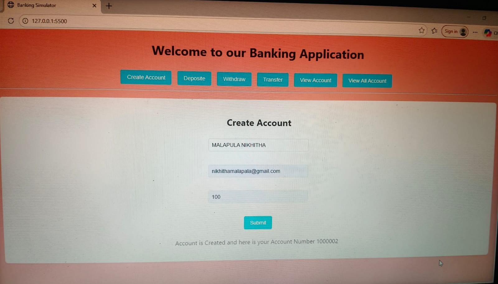
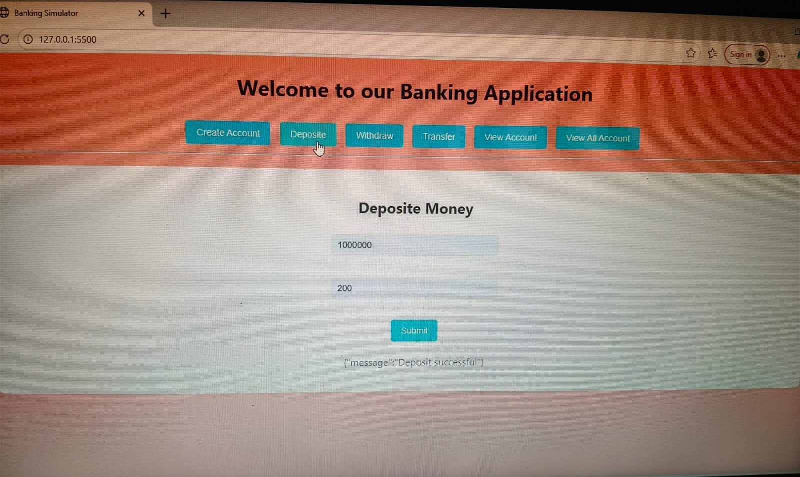
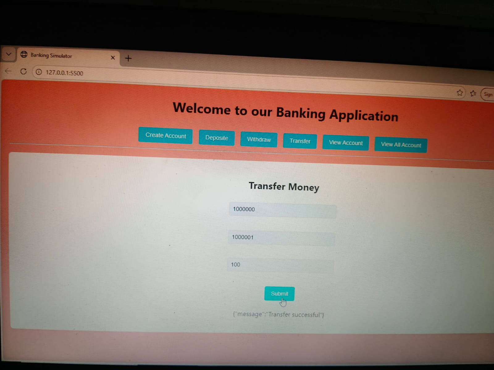
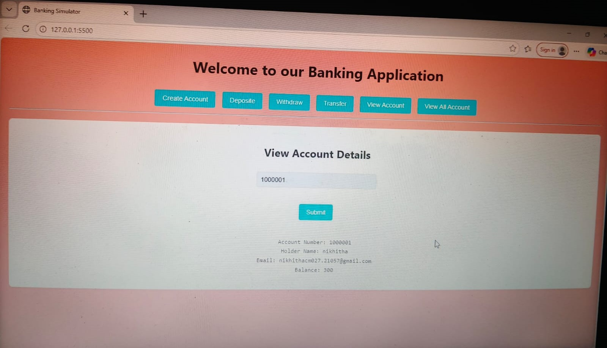
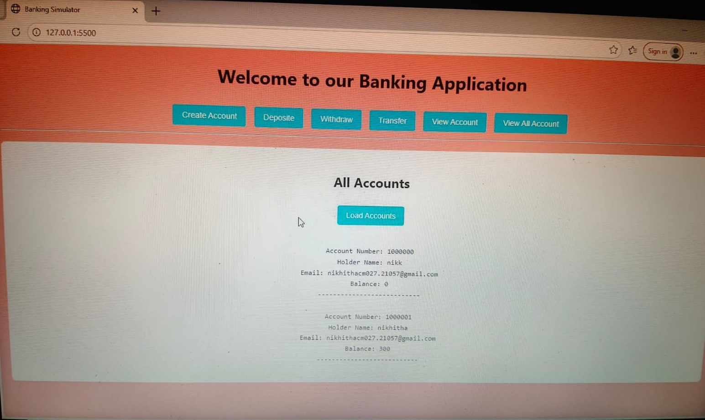

# banking-simulator
🏦 Banking Simulator Backend
The Banking Simulator Backend is a Java-based backend application that simulates core banking operations such as account management, transactions, and fund transfers.
It demonstrates backend development concepts including Object-Oriented Programming (OOP), exception handling, and layered architecture.

This project is designed to model real-world banking workflows in a simplified and scalable way.
# Features
<h3>Create Account</h3>

<h3>Deposit</h3>

<h3>Transfer</h3>

<h3>Withdraw</h3>

<h3>View Account</h3>

<h3>All Accounts</h3>

<h3>Email Alert</h3>

🛠️ Tech Stack

Programming Language: Java

Build Tool: Maven

Architecture: Layered / OOP-based design

Tools & IDEs: IntelliJ IDEA / Eclipse / VS Code

📂 Project Structure

Banking_Simulator_Backend/
│── src/
│   ├── model/        # Account and transaction models
│   ├── service/      # Business logic
│   ├── repository/   # Data handling layer
│   ├── exceptions/   # Custom exceptions
│   └── main/         # Application entry point
│── pom.xml           # Maven dependencies
│── images
|── records
│── README.md

🚀 Getting Started
Prerequisites

Java 8 or above

Maven

Git

# Installation
git clone https://github.com/Nikhitha999-nikki/Banking_Simulator_Backend.git
cd Banking_Simulator_Backend
mvn clean install

📌 Future Enhancements
🔐 User authentication and authorization
