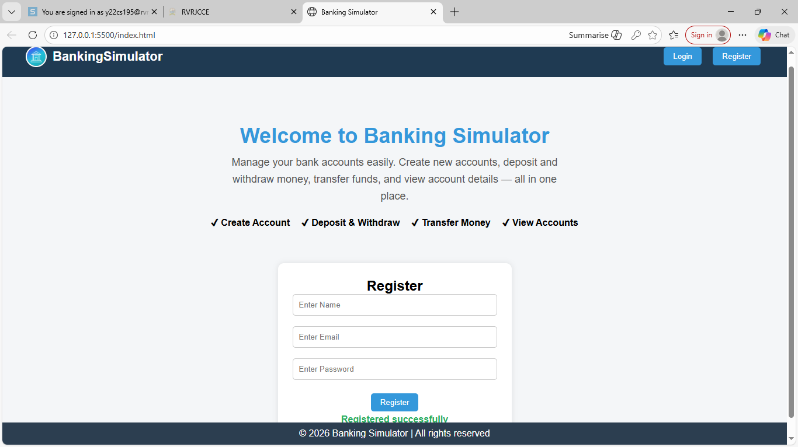
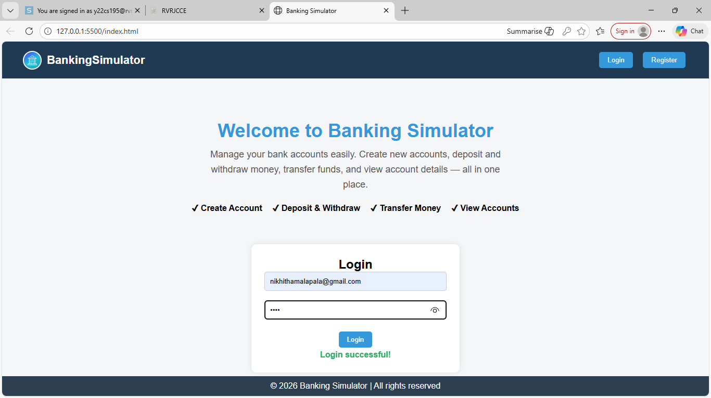
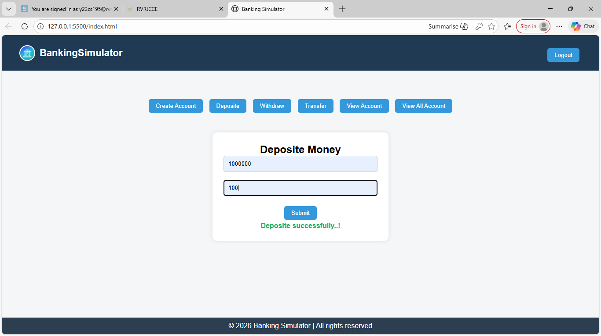
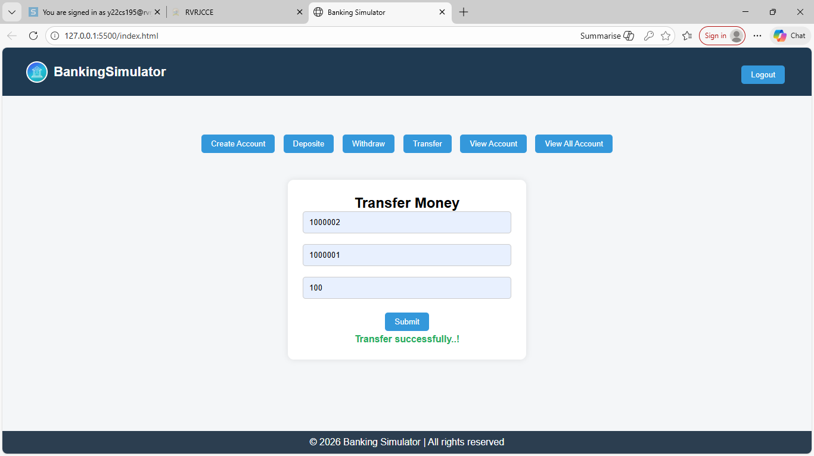
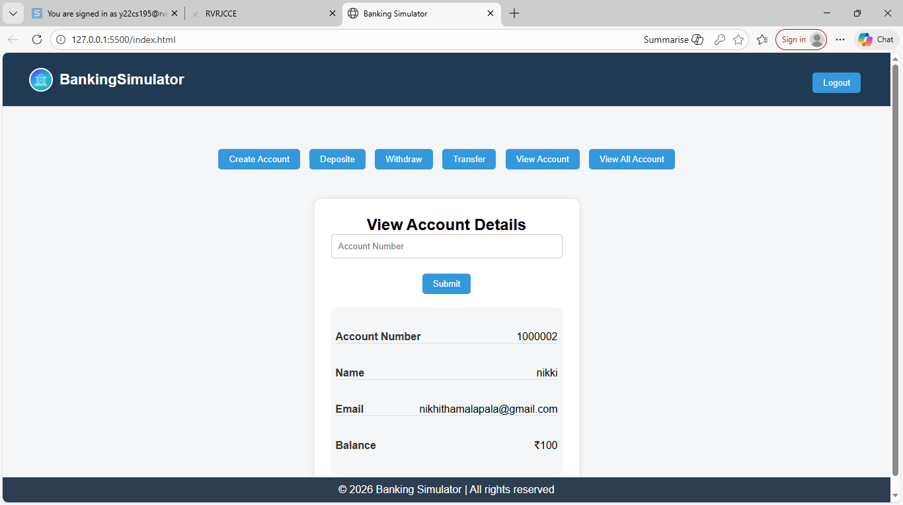
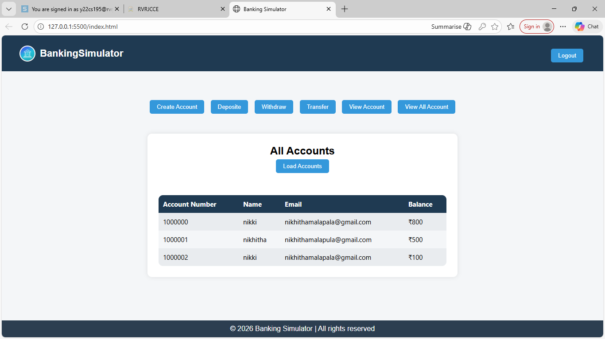
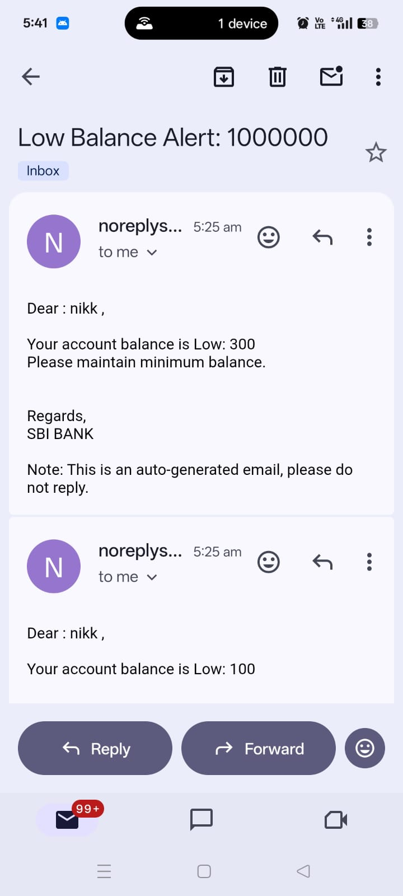

# banking-simulator

🏦 Banking Simulator Backend

The Banking Simulator Backend is a Java-based backend application that simulates core banking operations such as account management, transactions, and fund transfers.
It demonstrates backend development concepts including Object-Oriented Programming (OOP), exception handling, layered architecture, and now user authentication with register and login.

This project is designed to model real-world banking workflows in a simplified and scalable way.

# Features
# User Authentication

Register: New users can create an account with name, email, and password.

Login: Existing users can securely log in to access banking services.

# Operations

<h3>Deposit</h3>

<h3>Transfer</h3>

<h3>Withdraw</h3>

<h3>View Account</h3>

<h3>All Accounts</h3>

<h3>Email Alert</h3>

# 🛠️ Tech Stack

Programming Language: Java

Build Tool: Maven

Architecture: Layered / OOP-based design

Tools & IDEs: IntelliJ IDEA / Eclipse / VS Code

# 📂 Project Structure

Banking_Simulator_Backend/
│── src/

│   ├── model/        # Account and transaction models

│   ├── service/      # Business logic

│   ├── repository/   # Data handling layer

│   ├── exceptions/   # Custom exceptions

│   └── main/         # Application entry point

│── pom.xml           # Maven dependencies

│── images

|── records

│── README.md

# 🚀 Getting Started

Prerequisites

Java 8 or above

Maven

Git

# Installation

git clone https://github.com/Nikhitha999-nikki/Banking_Simulator_Backend.git

cd Banking_Simulator_Backend

mvn clean install

# 📌 Future Enhancements

🔐 Encryption
